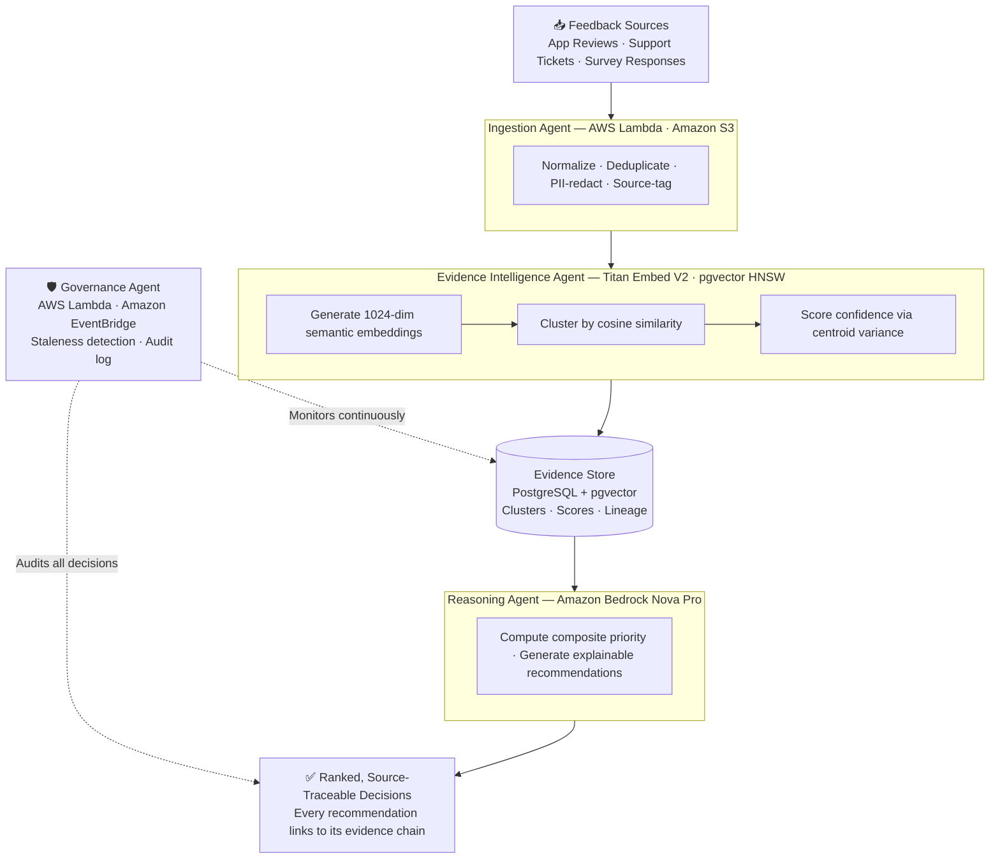
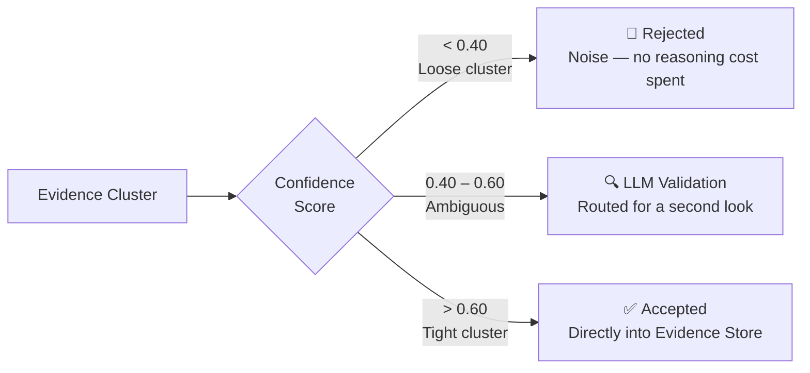

# Veloquity — Architecture

## What This Architecture Solves

Organizations receive feedback continuously — reviews, tickets, surveys, complaints — and have no reliable way to determine which signals represent real, recurring, significant issues versus noise that happens to use similar language.

The core failure isn't volume. It's trust. Traditional tools count keywords or display dashboards, which means 50 people using "crash" as a metaphor can outrank 5 engineers reporting the same reproducible bug. Veloquity introduces a different approach: every feedback signal is embedded, clustered by semantic similarity, scored by how coherently the group actually agrees with itself, and ranked by evidence quality — not by frequency.

Every recommendation carries a traceable chain from decision back to the exact original feedback items that produced it.

The architecture that delivers this is a four-stage serverless pipeline plus one cross-cutting governance agent. Each stage has a single, well-defined job. No stage does more than one transformation. No stage needs to understand what happens inside any other — only what it receives and what it must hand off.

---

## Pipeline Overview

Feedback flows strictly left to right. The Governance Agent does not sit in that sequence — it runs independently on a schedule, watching the evidence store and decision history without gating or blocking any individual request.

---

## Agent-by-Agent

### 1. Ingestion Agent

**Role:** Accept raw feedback in whatever form it arrives and produce a clean, safe, non-duplicated record the rest of the pipeline can trust.

**AWS Services:** AWS Lambda · Amazon S3 · AWS Secrets Manager

| | |
|---|---|
| **Receives** | Raw feedback from any connected source — reviews, tickets, survey exports, portal complaints |
| **Produces** | Normalized, PII-redacted, deduplicated, source-tagged records in date-partitioned S3 storage |

**What happens inside:**
- **Normalization** — standardizes fields, encoding, and structure across source formats so every downstream stage sees a consistent record shape regardless of origin
- **PII redaction** — strips personal identifiers before any downstream processing can access them
- **Deduplication** — identifies and collapses near-identical records so the same complaint submitted from two sources counts once, not twice
- **Source tagging** — preserves where each item came from so traceability extends all the way back to the original source system

---

### 2. Evidence Intelligence Agent

**Role:** Turn a set of individually meaningless feedback records into a smaller set of coherent, confidence-scored evidence groups that the Reasoning Agent can actually reason over.

**AWS Services:** Amazon Bedrock (Titan Embed V2) · Amazon RDS PostgreSQL (pgvector, HNSW index)

| | |
|---|---|
| **Receives** | Normalized feedback records from the Ingestion Agent |
| **Produces** | Evidence clusters — each carrying a confidence score, representative quote, user count, and full lineage back to source items |

**What happens inside:**

**Embedding:** Each feedback item is converted into a 1024-dimensional semantic vector using Titan Embed V2. This captures meaning, not keywords — "the app keeps closing" and "app crashes constantly" land near each other in vector space even though they share no words.

**Clustering:** Related embeddings are grouped using pgvector's HNSW index, which performs fast approximate nearest-neighbor search over the 1024-dimensional space. Items that agree semantically are pulled into the same evidence cluster.

**Confidence scoring:** Each cluster is scored based on how tightly its members actually agree with one another. A tight, coherent group scores high. A loose, vaguely-related group scores low. This is the core mechanism that separates signal from noise — frequency is irrelevant, coherence is everything.

**Evidence formation:** Clusters that pass confidence thresholds become evidence items carrying the score, a representative quote, contributing user count, and a complete lineage map to every source record.

---

### 3. Reasoning Agent

**Role:** Reason across the current evidence base and produce a ranked set of explainable, source-linked recommendations.

**AWS Services:** Amazon Bedrock (Nova Pro) · Amazon S3

| | |
|---|---|
| **Receives** | Confidence-scored evidence from the Evidence Store |
| **Produces** | A ranked set of recommendations — each with a priority score, reasoning explanation, and trace back to source |

**What happens inside:**

**Priority scoring:** Evidence is ranked using a composite score that weighs confidence, affected user count, cross-source corroboration, and recency — not any single factor in isolation. A cluster of 5 tightly related bug reports from multiple sources scores higher than 50 loosely related mentions that dominate by volume alone.

**Agentic reasoning:** Nova Pro reasons over the evidence rather than applying a fixed ruleset. It weighs conflicting signals, considers trade-offs, and produces an explanation of its ranking — not just a number.

**Source traceability:** Every recommendation links back through its evidence cluster to the exact original feedback items that generated it. A reviewer can click through to the specific user voices behind a recommendation, not just a generated summary of them.

> **Why Nova Pro:** The reasoning stage was originally designed around Anthropic Claude. However, AWS accounts under AISPL billing — used for Indian AWS accounts — cannot access Anthropic models on Bedrock. Nova Pro is first-party AWS, available universally regardless of billing entity, which made it the only model that could be relied on across all deployment contexts. Switching required restructuring the request format; the reasoning logic itself required no changes.

---

### 4. Governance Agent

**Role:** Keep the evidence base and decision history honest as time passes — independent of and running alongside the other three agents.

**AWS Services:** AWS Lambda · Amazon EventBridge (scheduled trigger) · Amazon RDS PostgreSQL

| | |
|---|---|
| **Receives** | Current state of the evidence store and decision history |
| **Produces** | Staleness flags · Signal promotions · Append-only audit log of every governance action |

**What happens inside:**
- **Staleness detection:** Evidence that hasn't been referenced in recent decisions is flagged — old signals don't silently continue influencing rankings
- **Signal promotion:** Feedback patterns that repeatedly score just below the acceptance threshold are surfaced for review rather than silently discarded
- **Audit log:** Every governance action is written to an append-only log. No evidence modification goes unrecorded.

---

## Confidence Routing

Every evidence cluster is routed based on its confidence score before it reaches the Reasoning Agent. This is what makes the pipeline economically viable — the expensive LLM reasoning step is reserved only for evidence that has earned it.

A cluster of 50 loosely related complaints scores low — it's discarded. Five tightly worded bug reports score high — they drive a recommendation. Volume doesn't win. Coherence does.

---

## Key Architectural Decisions

### 1. Serverless and event-driven, not a standing service

Every agent is a Lambda function triggered by the event that makes it relevant — not a server running continuously. This delivers two guarantees simultaneously:

- **Fault isolation:** A failure in one stage cannot cascade into another because each stage is separated by an event boundary. The Evidence Intelligence Agent can fail without touching the Ingestion Agent's output.
- **Zero idle cost:** There's no compute running when the system isn't actively processing. Cost scales to usage, not to uptime.

### 2. pgvector with HNSW inside PostgreSQL

Evidence clustering requires fast approximate nearest-neighbor search over 1024-dimensional embeddings — but it also needs that search to sit next to ordinary relational data (timestamps, sources, confidence scores, lineage maps) that the rest of the system depends on.

Running HNSW inside PostgreSQL via pgvector avoids operating and syncing a second, separate vector database. One database, one source of truth, one connection pool, sub-10ms search at the volumes this system runs at.

### 3. Deterministic everywhere except reasoning

Every stage except Reasoning runs deterministically — normalization, deduplication, embedding, clustering, confidence scoring, governance are all rule-based or mathematical. Only the final recommendation generation uses an LLM.

This keeps the system auditable, reproducible, and cheap. The LLM is applied where judgment is actually required; everywhere else, correctness is enforced by logic, not by hoping the model gets it right.

---

## Clustering Evolution

The Evidence Intelligence Agent's clustering approach has gone through more than one iteration. It started as a simpler greedy cosine-similarity grouping method — straightforward to reason about and fast to ship. A dedicated experimentation branch later explored density-based clustering (HDBSCAN) to test whether cluster boundaries could better reflect natural groupings in the data, rather than the more mechanical similarity-threshold approach.

This matters because how evidence gets grouped directly determines the confidence score it receives — and downstream, whether it ever reaches a human decision-maker at all. Clustering is treated as a variable that affects output quality in ways that only become visible at validation time, not a detail settled once at the start of the build.
