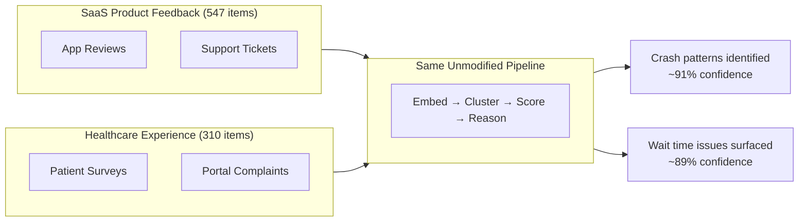

# Veloquity — Evaluation

## What Was Validated

The goal was never just "does the pipeline complete without errors." The real question was whether the system reasons *correctly* — whether it groups related feedback the way a careful analyst would, whether confidence scores actually track how coherent a group of evidence is, whether identical inputs produce consistent outputs, and whether every recommendation can be traced back to real, specific source records rather than a plausible-sounding generated summary.

Three validation tracks ran in parallel: an automated test suite for logic correctness, a full pipeline benchmark for real-world cost and latency, and a domain-generalization test using two structurally unrelated real-world datasets.

---

## At a Glance

| Metric | Result |
|---|---|
| Automated tests | **158 tests, 100% passing** |
| Test suite runtime | **0.72 seconds** (fully mocked — no live AWS or DB calls) |
| Full pipeline cost | **$0.029 per run** |
| Cached run cost | **~$0.013** (embeddings skipped on unchanged corpus) |
| End-to-end latency | **~91 seconds** |
| SaaS dataset | 547 items |
| Healthcare dataset | 310 items |
| Total validated | **857 items across 2 unrelated domains** |

---

## Test Suite

**158 automated tests · 100% passing · 0.72 seconds total runtime**

The suite runs fully mocked — zero live AWS or database calls — which is why it completes in under a second and can be run safely and repeatedly in any environment, including CI pipelines. Every test exercises real logic, not mock assertions about whether a function was called.

Tests are organized around the categories of logic that determine whether the system is actually trustworthy:

### Deduplication and Normalization
Confirms that near-identical feedback records — the same complaint submitted from two different sources — are correctly identified and collapsed before embedding, so they count as one signal, not two. Also validates that malformed, partial, or encoding-broken input is caught at ingestion and handled without silently corrupting the records that follow it through the pipeline.

### Clustering Stability
Confirms that evidence grouping behaves consistently given the same inputs, and that confidence scoring responds correctly to cluster quality in both directions. A tight group of closely related feedback should score high. A loose collection of vaguely similar items should score low. Tests verify the scoring behaviour, the routing decisions that follow from it, and the stability of both across repeated runs.

### Priority and Routing Logic
Confirms that evidence is routed to the correct next step — rejected, escalated for validation, or accepted — based on its confidence score. Also validates that composite priority ranking across multiple factors behaves predictably as inputs change, including edge cases where factors conflict: high confidence but low user count, high user count but poor corroboration across sources.

### Failure Isolation
Confirms that a failure in one stage is contained at that stage. A malformed record in the ingestion batch, a missing field in an evidence item, a simulated timeout — none of these should silently corrupt or block unrelated evidence moving through the rest of the pipeline. Every failure produces a specific, logged, recoverable error rather than a silent bad output.

---

## Cost Benchmark

Measured on a full pipeline run across the combined validation dataset (857 items):

| Component | Cost | Notes |
|---|---|---|
| Embeddings — Titan Embed V2 | $0.016 | Per-item embedding generation |
| Reasoning — Nova Pro | $0.013 | Evidence reasoning + recommendation generation |
| **Full run total** | **$0.029** | End-to-end, cold start included |
| Cached run total | ~$0.013 | Embeddings skipped when corpus is unchanged |

**Why it's this low:** The LLM is confined to a single stage — Reasoning. Every other stage runs deterministically without any model calls. Normalization, deduplication, embedding, clustering, confidence scoring, and governance are all mathematical or rule-based. Embedding reuse on unchanged input reduces cost further for re-runs over the same corpus.

At this cost profile, Veloquity runs a complete analysis of 857 real-world feedback records for under three cents.

---

## Latency Breakdown

| Stage | Latency | What's Happening |
|---|---|---|
| Ingestion | ~18s | Normalization, PII redaction, deduplication, S3 writes |
| Evidence Intelligence | ~34s | Titan V2 embedding generation + HNSW clustering + confidence scoring |
| Reasoning | ~27s | Nova Pro reasoning over evidence + recommendation generation |
| Governance | ~12s | Staleness checks + audit log write |
| **Total** | **~91s** | End-to-end, including cold start |

The 91-second total leaves substantial headroom within Lambda's execution limits, with room to scale input volume meaningfully before latency becomes a constraint.

```mermaid
gantt
    title Pipeline Latency Profile (~91s total)
    dateFormat  s
    axisFormat %Ss

    section Stages
    Ingestion Agent         :a1, 0, 18s
    Evidence Intelligence   :a2, after a1, 34s
    Reasoning Agent         :a3, after a2, 27s
    Governance Agent        :a4, after a3, 12s
```

---

## Domain-Agnostic Validation

The strongest claim Veloquity makes is that the pipeline is domain-agnostic — the same code, unmodified, produces meaningful evidence and recommendations regardless of what kind of feedback it processes. To test this, two structurally unrelated real-world datasets were run through the exact same, unchanged pipeline.

| Domain | Volume | Sources | Example Evidence Surfaced |
|---|---|---|---|
| SaaS product feedback | 547 items | App store reviews + support tickets | Crash pattern tied to a specific action sequence (~91% confidence) · Performance regression following a recent release · UI friction in onboarding flow |
| Healthcare patient experience | 310 items | Patient portal complaints + post-visit surveys | Extended emergency department wait times (~89% confidence) · Recurring appointment booking failures · Medication communication gaps between departments |

**Same embeddings model. Same clustering approach. Same confidence scoring. Same reasoning agent.** Two completely unrelated feedback domains — software crashes and emergency room wait times — processed without any code changes, prompt engineering per domain, or domain-specific configuration of any kind.

This proves Veloquity operates on semantic intelligence, not domain rules. The evidence pipeline generalizes because the underlying mechanism — group by meaning, score by coherence, reason over evidence — is not specific to any industry or feedback type.

---

## Confidence Routing — Validation Results

| Confidence Tier | Score Range | What the Data Showed |
|---|---|---|
| Rejected | Below 0.40 | High-variance clusters — vaguely similar but not coherently related. Included figurative uses of "crash" mixed with literal crash reports. Discarding these correctly prevented noise from influencing decisions. |
| Validated | 0.40 – 0.60 | Ambiguous clusters — trending signals not yet strong enough to accept outright, but consistent enough to warrant a second look rather than silent rejection. |
| Accepted | Above 0.60 | Tight, coherent groups — contributors clearly describing the same underlying issue from different angles, different sources, and different phrasings. These drove all final recommendations. |

The three-tier routing is what keeps reasoning cost low without sacrificing signal quality at the top end. Nova Pro is called only on evidence that has already cleared a semantic coherence threshold. Noise never reaches the expensive reasoning stage.

---

## Real-World Production Failures Resolved

These were genuine failures encountered during the build — not edge cases constructed in a test environment. They represent the difference between a prototype that works in isolation and a system that has been run against real AWS infrastructure and debugged to a production-ready state.

### Model Access Blocked by Billing Entity
**What happened:** The reasoning stage was originally built around Anthropic Claude on Bedrock. AWS accounts under AISPL billing — used for Indian AWS accounts — cannot access Anthropic models. The API returned `AccessDeniedException`, making the entire reasoning stage non-functional for this deployment configuration.

**Resolution:** The reasoning pipeline was refactored to use Amazon Nova Pro, which is first-party AWS and available universally regardless of billing entity. This required restructuring the request format — system prompts as typed list-of-dicts, content as typed objects, inference parameters moved into a separate config object — but the reasoning logic itself required no changes.

**Why it matters:** A platform claiming global deployability has to actually work for every AWS customer, not just those with a specific billing configuration.

---

### Private Networking Blocked Model Access
**What happened:** A Lambda function deployed inside a VPC could not reach the Bedrock API endpoint. Without a VPC endpoint or NAT gateway, the Bedrock call timed out silently rather than returning a diagnostic error.

**Resolution:** Network configuration was adjusted to allow the relevant Lambda to reach the Bedrock endpoint directly without routing through the VPC boundary.

---

### Deployment Configuration Mismatch
**What happened:** A Lambda's configured handler path pointed to the wrong entry point after a deployment restructuring. Invocations returned opaque failures rather than useful diagnostic errors, making the mismatch hard to identify.

**Resolution:** The deployment configuration was corrected to point at the actual entry point after the restructure.

---

### Missing Runtime Dependency
**What happened:** File upload handling failed in production with HTTP 422 errors. A required server-side library for multipart form data parsing was present in the local development environment but not declared in the deployment requirements — so it was absent in the Lambda execution environment.

**Resolution:** The missing dependency was identified and added to the deployment requirements.

---

## Summary

Veloquity's validation work produced three verifiable outputs: a test suite that proves the logic is correct and stable across 158 test cases, benchmarks that prove the system is economically viable at real workloads ($0.029/run, ~91s end-to-end), and a cross-domain run that proves the intelligence layer genuinely generalizes rather than being tuned to one specific input type.

The production failure modes are documented not as caveats but as evidence — a system that has survived contact with real AWS infrastructure and been debugged to the point where these specific failure modes are understood, handled, and won't recur.
