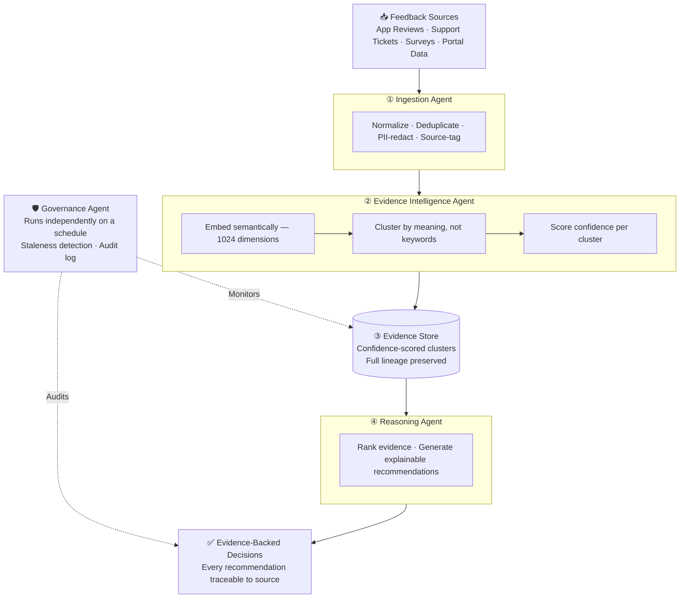
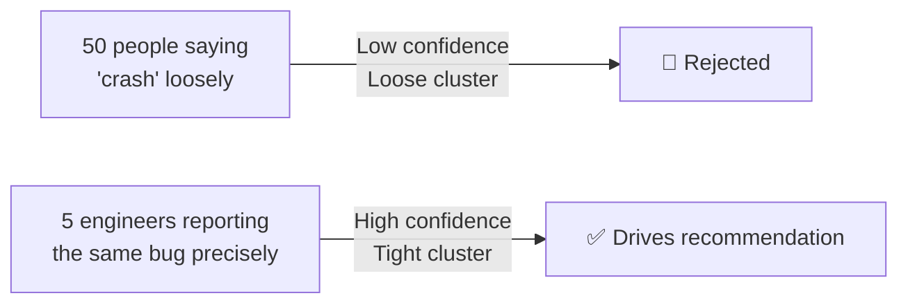

<div align="center">


[](#recognition)
[](https://youtu.be/wEG5jTQxlJ4?si=l1tH72icmjTMdh_H)
[](https://builder.aws.com/content/3AzrKpJbhJwEP6EZbm87vdxufgi/aideas-finalist-veloquity-the-agentic-evidence-intelligent-platform-turning-raw-feedback-into-evidence-driven-decisions)
[](https://veloquity1.vercel.app)

<br/>


</div>

---

## About This Repository

This is the public documentation showcase for Veloquity. The source code is maintained in a private repository. What's here is a complete record of what was designed, how it was validated, and what it actually produced.

| Document | What It Covers |
|---|---|
| This README | System overview, pipeline architecture, validation results, recognition |
| [ARCHITECTURE.md](ARCHITECTURE.md) | Agent-by-agent design, Mermaid diagrams, AWS service roles, key architectural decisions, clustering evolution |
| [EVALUATION.md](EVALUATION.md) | Test suite, cost benchmarks, latency breakdown, domain-agnostic validation, real production failure modes |

The full technical write-up is on the [AWS Builder Center](https://builder.aws.com/content/3AzrKpJbhJwEP6EZbm87vdxufgi/aideas-finalist-veloquity-the-agentic-evidence-intelligent-platform-turning-raw-feedback-into-evidence-driven-decisions). Source code available on request.

---

## The Problem

**Organizations today are not lacking feedback. They are lacking clarity.**

Feedback arrives continuously across product teams, hospitals, and public systems — support tickets, app reviews, survey responses, and user complaints. Each signal seems small in isolation. Collectively, they form a pattern. But that pattern is hard to see.

The same underlying issue may arrive described in completely different ways:
- a crash report
- a vague complaint  
- a frustrated review
- a detailed support ticket

Most teams still rely on manual interpretation — reading feedback, scanning tickets, prioritizing based on intuition. At small scale, this works. At large scale, it fails. Organizations may process thousands of inputs yet still miss the single issue affecting the most users.

**Veloquity was built to close that gap.**

---

## What Was Built

A fully serverless, agentic pipeline that transforms raw, unstructured feedback into prioritized, evidence-backed decisions — with every recommendation traceable back to the exact source item that produced it.



| Stage | Job | Core AWS Technology |
|---|---|---|
| Ingestion | Normalize, protect, and deduplicate raw feedback | AWS Lambda · Amazon S3 |
| Evidence Intelligence | Embed and cluster feedback into confidence-scored evidence | Amazon Titan Embed V2 · RDS PostgreSQL (pgvector, HNSW) |
| Reasoning | Reason over evidence into ranked, source-linked recommendations | Amazon Bedrock (Nova Pro) |
| Governance | Detect staleness, promote signals, maintain audit trail | AWS Lambda · Amazon EventBridge |

---

## How It's Different

### Traceability, not a black box

Every recommendation Veloquity produces links back through its evidence to the exact original feedback items — source, timestamp, and context, not just a generated paragraph. If a recommendation can't be traced to real evidence, it isn't surfaced.

```
Raw Feedback  →  Evidence Cluster  →  Confidence Score  →  Reasoning  →  Decision
     ↑______________________________________________↑
                    Full lineage preserved
```

### Confidence scoring, not keyword counting

Evidence isn't ranked by how often a word appears. Related feedback is embedded and grouped semantically, then scored on how tightly the group actually agrees with itself.



Volume doesn't win. Coherence does.

### Agentic reasoning, not static rules

The recommendation step isn't a fixed rulebook. A reasoning agent retrieves the relevant evidence, weighs it against multiple factors — confidence, user count, cross-source corroboration, recency — and generates a structured, explainable recommendation. Consistent across every run. Not hardcoded to any domain.

---

## Validated On

Veloquity's core claim is domain-agnostic intelligence. The same code, unmodified, processes meaningful evidence and recommendations regardless of what kind of feedback it receives.

| Domain | Volume | Result |
|---|---|---|
| SaaS product feedback (app reviews + support tickets) | 547 items | Coherent evidence clusters, ranked recommendations |
| Healthcare patient experience (portal + survey data) | 310 items | Same pipeline, zero code changes |
| **Combined** | **857 items** | **One pipeline. Two unrelated domains.** |

**Performance and cost, measured end-to-end:**

| Metric | Result |
|---|---|
| Full pipeline runtime | ~91 seconds |
| Cost per full run | $0.029 |
| Automated test suite | 158 tests, 100% passing |
| Test suite runtime | 0.72 seconds (fully mocked) |

---

## AWS Services

| Service | Role in Veloquity |
|---|---|
| AWS Lambda | Hosts all four pipeline agents |
| Amazon Bedrock — Nova Pro | Reasoning and recommendation generation |
| Amazon Bedrock — Titan Embed V2 | 1024-dimensional semantic embeddings |
| Amazon RDS (PostgreSQL + pgvector) | HNSW vector search and relational storage |
| Amazon S3 | Feedback storage and reasoning run archival |
| Amazon EventBridge | Scheduled governance triggers |
| AWS IAM | Access control across all services |
| AWS Secrets Manager | Credential management — nothing hardcoded |

---

## Recognition

<a name="recognition"></a>

Veloquity won the **AWS 10,000 AIdeas Asia Pacific & Japan (APJC) Regional Championship 2026**, selected from 10,000+ teams across 115 countries.

- 🏆 **AWS APJC Regional Champion** — $15,000 prize support · $1,500 AWS credits · AWS re:Invent Las Vegas invitation
- 📋 Official winners list: [`assets/aws-apjc-winners-list.png`](assets/aws-apjc-winners-list.png)
- 📰 Full technical write-up: [AWS Builder Center Article](https://builder.aws.com/content/3AzrKpJbhJwEP6EZbm87vdxufgi/aideas-finalist-veloquity-the-agentic-evidence-intelligent-platform-turning-raw-feedback-into-evidence-driven-decisions)
- 🎥 Demo video: [Watch on YouTube](https://youtu.be/wEG5jTQxlJ4?si=l1tH72icmjTMdh_H)
- 🌐 Live platform: [veloquity1.vercel.app](https://veloquity1.vercel.app)
- 📰 Featured in **Business Today** alongside **Jeff Barr** *(VP & Chief Evangelist, AWS)*

---

<div align="center">

</div>
